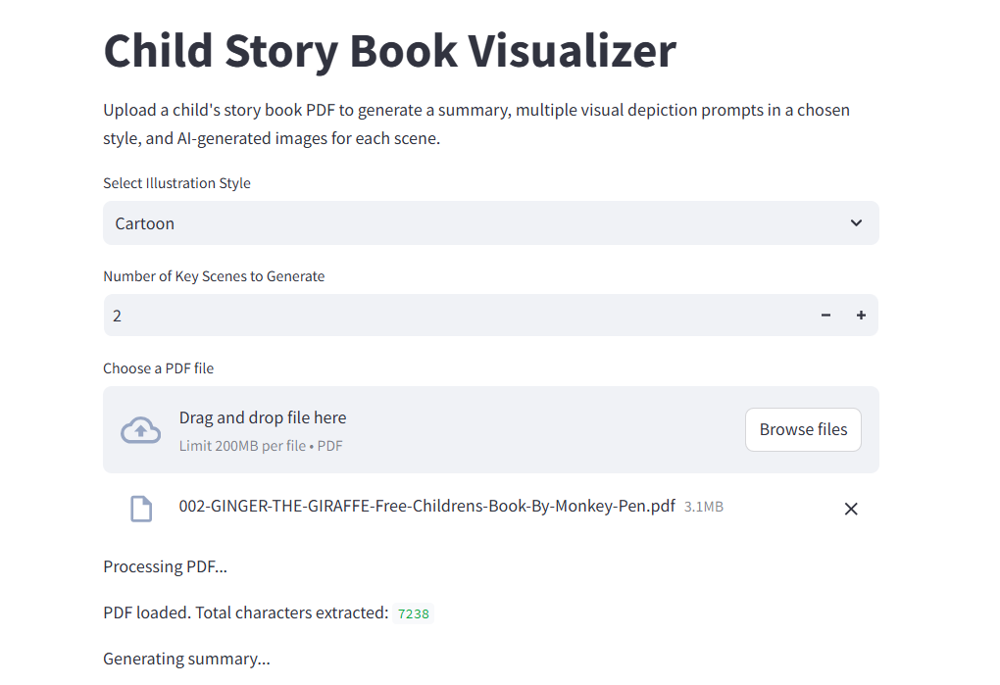
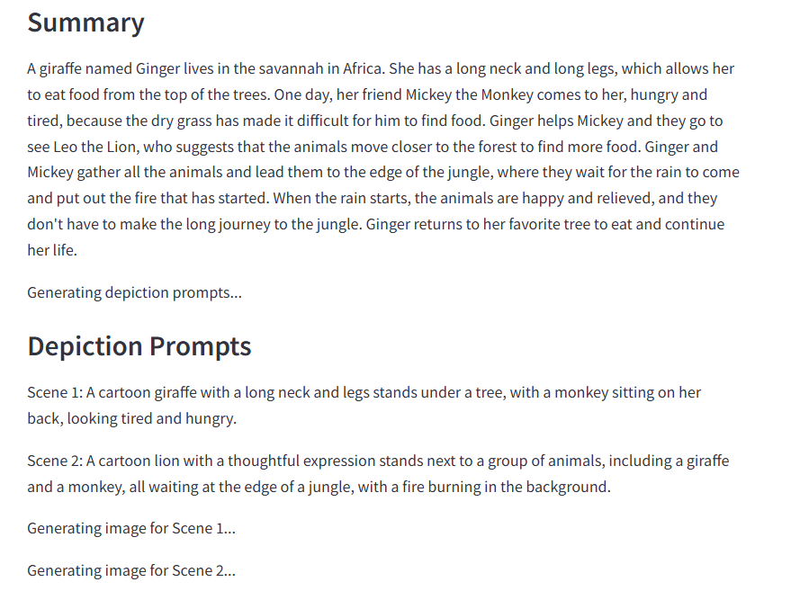
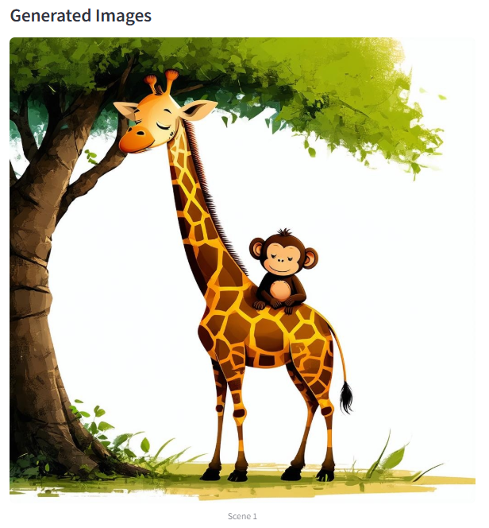
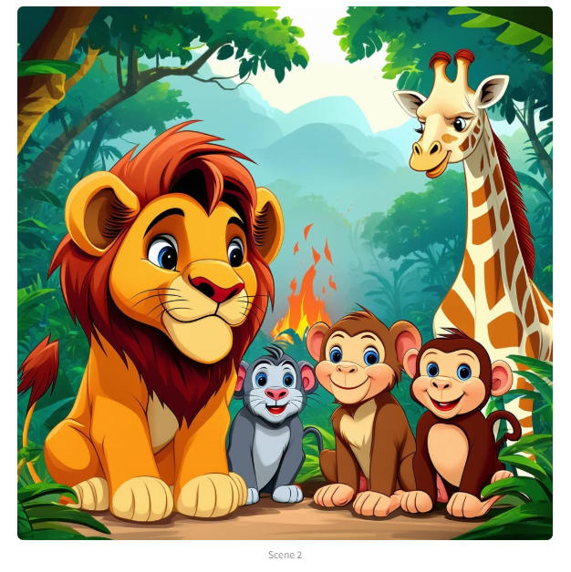

# Child Story Book Visualizer 

A multi-modal application that transforms a child's storybook PDF into a visual narrative! This project takes an uploaded PDF of a children’s story, extracts and summarizes its content, generates multiple visual depiction prompts in a user‑selected illustration style, and then uses a text-to-image AI model (via the Hugging Face Inference API) to produce a gallery of illustrations depicting key scenes from the story.

The project is organized into two variations:
- **Standard Application (`app/`):** Uses a base model (e.g. `stabilityai/stable-diffusion-3.5-large`) to generate illustrations.
- **Fine-Tuned Application (`app_w_finetuned_model/`):** Uses a version of the Stable Diffusion XL Base 1.0 model that has been fine-tuned on a dataset of old book illustrations to produce a customized artistic output.

---

## Table of Contents

- [Overview](#overview)
- [Features](#features)
- [Project Structure](#project-structure)
- [Installation and Setup](#installation-and-setup)
- [Usage](#usage)
  - [Standard Application](#standard-application)
  - [Fine-Tuned Application](#fine-tuned-application)
- [Finetuning Process](#finetuning-process)
- [Configuration and API Keys](#configuration-and-api-keys)
- [Future Improvements](#future-improvements)
- [Contributing](#contributing)
- [License](#license)
- [Acknowledgements](#acknowledgements)

---

## Overview

The **Child Story Book Visualizer Pipeline** is designed to bridge text and image generation in a playful, educational, and creative way. When a user uploads a children’s storybook PDF, the system performs the following steps:

1. **Document Loading and Preprocessing:**  
   The PDF is loaded and its pages are concatenated into a single unified text.

2. **Story Summarization:**  
   A language model generates a concise summary of the story.

3. **Depiction Prompt Generation:**  
   Based on the summary and a user-selected illustration style, the system generates multiple short, clear prompts describing key scenes from the story. The prompts are generated as a strict JSON array so that they can be reliably parsed.

4. **Image Generation:**  
   Each prompt is sent as a separate API call to a text-to-image model, and the resulting images are displayed as a gallery.

The application offers users the ability to select the illustration style (e.g. Photorealistic, Cartoon, Watercolor, Vintage, Anime) and the number of key scenes they wish to visualize.

---

## Example UI Screenshots

### Uploading a Storybook PDF

## Generating Summary and Depictions From the Storybook

### Generated Images Examples



## Features

- **PDF Story Extraction:** Automatically load and parse PDF files of children’s stories.
- **Automated Summarization:** Generate a concise summary of the story content.
- **Multi-Scene Depiction Prompts:** Generate multiple scene prompts in a structured JSON format.
- **Customizable Illustration Style:** Let users choose from several illustration styles to tailor the AI-generated images.
- **AI-Generated Visualizations:** Produce a gallery of images—one for each scene prompt.
- **Dual Application Versions:**  
  - **Standard Version:** Uses a base image-generation model.
  - **Fine-Tuned Version:** Uses a fine-tuned model (Stable Diffusion XL Base 1.0 fine-tuned on old book illustrations) for more tailored artistic output.
- **Streamlit-Based UI:** Simple and interactive web interface for uploading PDFs and viewing results.

---

## Project Structure

```
ChildStoryBookVisualizer/
├── app/
│   ├── app.py                # Main Streamlit application using the base image generation model.
├── app_w_finetuned_model/
│   ├── sd-model-finetuned    # Directory containing the fine-tuned model weights (Stable Diffusion XL Base 1.0 fine-tuned on AdamLucek/oldbookillustrations-small).
│   ├── app.py                # Streamlit application (same logic as in app/app.py, but using the fine-tuned model).
│   └── finetuning.ipynb      # Jupyter Notebook detailing the finetuning process.
├── images/
│   ├── pdf_loading.png
│   ├── depiction_generation.png
│   ├── generated_image1.png
│   ├── generated_image2.png
├── README.md                 # This README file.
└── requirements.txt          # List of Python dependencies required for the project.
```

---

## Installation and Setup

1. **Clone the Repository:**

   ```bash
   git clone https://github.com/yourusername/ChildStoryBookVisualizer.git
   cd ChildStoryBookVisualizer
   ```

2. **Set Up a Virtual Environment:**

   ```bash
   python -m venv venv
   source venv/bin/activate  # On Windows use: venv\Scripts\activate
   ```

3. **Install Dependencies:**

   ```bash
   pip install -r requirements.txt
   ```

4. **Set Up API Keys:**

   - Open both `app/app.py` and `app_w_finetuned_model/app.py` and update the `HF_API_KEY` variable with your Hugging Face API key.

---

## Usage

### Standard Application

To run the standard version of the application:

1. Navigate to the `app/` directory:

   ```bash
   cd app
   ```

2. Launch the Streamlit app:

   ```bash
   streamlit run app.py
   ```

### Fine-Tuned Application

To run the fine-tuned version (using a model fine-tuned on old book illustrations):

1. Navigate to the `app_w_finetuned_model/` directory:

   ```bash
   cd app_w_finetuned_model
   ```

2. Launch the Streamlit app:

   ```bash
   streamlit run app.py
   ```

---

## Finetuning Process

The finetuning process is documented in the `finetuning.ipynb` notebook located in the `app_w_finetuned_model/` directory. The notebook includes:

- **GPU Availability Check**
- **Hugging Face Hub Login**
- **Installation of Diffusers**
- **Training Execution** using `accelerate launch`
- **Model Saving** for deployment in the fine-tuned application.

---

## Configuration and API Keys

- **Hugging Face API Key:**  
  Set the `HF_API_KEY` variable at the top of your Python files.
  
- **Environment Variables:**  
  Optionally, you can manage sensitive keys using environment variables or a `.env` file.

---

## Future Improvements

- **Enhanced Multi-Scene Customization**
- **Expanded Illustration Styles**
- **Interactive Story Editing**
- **Export to PDF for Digital Storybooks**
- **Text-to-Speech Narration Integration**

---

## Contributing

Contributions are welcome! Please open an issue or submit a pull request.

---

## License


---

## Acknowledgements

- **Hugging Face & LangChain**
- **Stable Diffusion & Stability AI**
- **AdamLucek/oldbookillustrations-small**
- **Streamlit**
- **Open Source Community**

---

